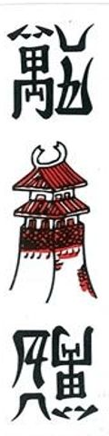

# Cách chơi Bài Chắn 120 quân của gia đình tôi

[English](public-rules.md) · [Tiếng Việt](public-rules.vi.md) · [Hướng dẫn có hình trong trò chơi](https://bai-chan-play.white-violet-3211.workers.dev/rules)

Đây là luật bàn chơi hiện tại của một gia đình. Bốn người thân đã trả lời bảng hỏi riêng; một số cách xử lý vẫn đang chờ xác nhận. Chắn trong nhiều tài liệu dùng 100 quân. Bàn chơi này giữ đủ 120 quân kiểu Tổ Tôm nhưng xếp bài ù bằng các đôi.

## 1. Nhận mặt quân

Có chín hàng (Nhất đến Cửu) ở mỗi chất Vạn, Văn, Sách, thêm Chi Chi, Lão, Thang: tổng cộng 30 mặt quân. Mỗi mặt có bốn quân giống nhau, thành 120 quân.

| Chắn: đôi giống hệt | Cạ: cùng hàng, khác chất | Chíu: bốn quân giống hệt |
| :---: | :---: | :---: |
|   |   |     |

Chắn trên tay vẫn được tính, không cần hạ trước. Có thể ăn Cạ trước khi đủ số Chắn tối thiểu. Chíu là lựa chọn của người chơi khi cầm ba quân giống hệt và quân thứ tư xuất hiện; hạ cả bốn quân, tính hai Chắn.

Ba mặt Nhất cùng Chi Chi, Lão và Thang thành nhóm đặc biệt. Bàn này cho phép ghép Cạ giữa các mặt trong nhóm; hai quân giống hệt vẫn là Chắn. Lão + Thang là mặc định tạm thời. Quân đặc biệt lẻ có thể ghép Cạ mà không tách các Chắn sẵn có. Cạ đặc biệt có thể nằm trong bài ù nhưng không được là đôi cuối làm thành Ù.

## 2. Chia bài và đi lượt

| Số người | Người mở đầu | Mỗi người khác | Số đôi để ù | Chắn tối thiểu |
| :--- | ---: | ---: | ---: | ---: |
| Bốn | 24 | 23 | 12 | 8 |
| Năm | 20 | 19 | 10 | 6 |

Người mở đầu đánh ngay, không bốc, hoặc ù ngay nếu bài đã đủ. Lượt đi theo chiều kim đồng hồ; người ù mở ván tiếp theo.

**Bốc** lật quân nọc công khai ở cửa, không đưa thẳng vào tay kín. Người đủ điều kiện có thể phản ứng. **Ăn** ghép quân trên bàn với quân trên tay, hạ đôi đó, rồi **Đánh** một quân khác. Khi Chíu ngoài lượt, người Chíu hạ bốn quân và trả một quân về cửa đang bị ngắt. Người ở cửa đó có thể ăn quân trả rồi đánh, hoặc chuyển tiếp chính quân được trả.

Bỏ ăn Chắn thì sau này không được ăn, Chíu hoặc đánh mặt quân ấy, kể cả quân bốc từ nọc. Bỏ Cạ vẫn được Chíu sau; phạm vi cấm ăn Cạ/Chắn sau đó còn đang bàn. Đã đánh một mặt quân thì không được ăn lại mặt ấy. Sau khi ăn Cạ, không được đánh cả hai bên của một Cạ hay tách Cạ sẵn có để ăn Cạ khác cùng nhóm.

## 3. Ù hoặc hết nọc

Phải ghép hết quân thành đôi và đạt số Chắn tối thiểu trong bảng. Chắn kín và đã hạ đều tính; Chíu tính hai Chắn. Quân bốc công khai có thể giúp bất cứ người đủ điều kiện nào ù. Quân người khác đánh chỉ giúp ù qua Chíu-Ù. Chi Chi, Lão hoặc Thang không được là quân hoàn thành Ù, kể cả Chíu-Ù; vẫn được Chíu Yêu khi chưa ù.

Ưu tiên Ù trước Chíu; nếu nhiều người cùng ù, xét thứ tự chỗ ngồi từ cửa đang có quân. Quân trả cửa cho phép Chíu và Chíu-Ù; Ù thường bằng quân trả còn chưa rõ. Bấm Bỏ Ù thì mất quyền ù về sau trong ván; đánh thay vì ù ngay lúc mở đầu cũng vậy. Chưa có thời hạn tự động khi im lặng hoặc mất kết nối. Người ù mở toàn bài để kiểm tra. Hết nọc mà chưa ai ù thì ván hòa; không trộn quân đã đánh vào nọc.

## Lựa chọn tạm thời

Trò chơi hiện ưu tiên Chắn trước Cạ; sau khi bỏ Cạ, cấm ăn Cạ cùng mặt nhưng vẫn cho ăn Chắn; không để quân dự trữ trong nọc; Chíu liên tiếp trả về cửa bị ngắt; và hoàn tất lượt cuối. Gia đình còn đang kiểm tra các điểm ấy, hạn nhận lại quân vừa bỏ, người mở sau ván hòa, cước và báo/phạt. Chưa tính cước hoặc phạt. Luật mới chỉ áp dụng từ ván chia kế tiếp.

[Chia sẻ luật gia đình bạn](https://bai-chan-rules.white-violet-3211.workers.dev/?lang=vi) · [Đọc trang tư liệu](https://michaelnguyen.net/baichan-vi.html)
